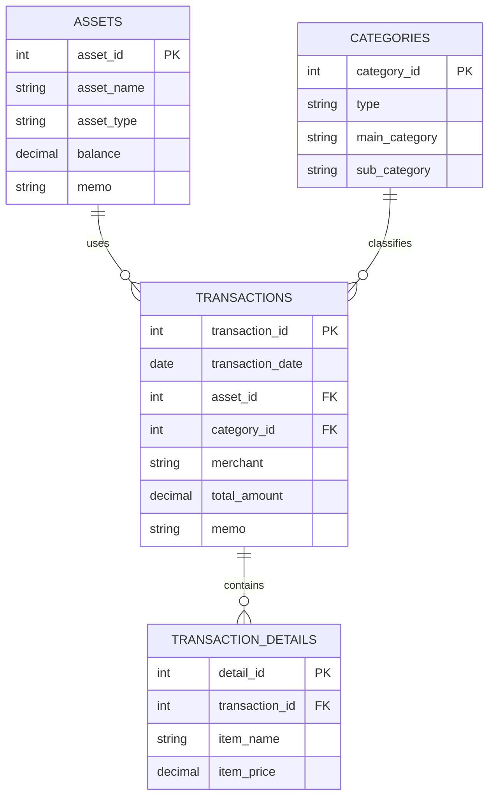
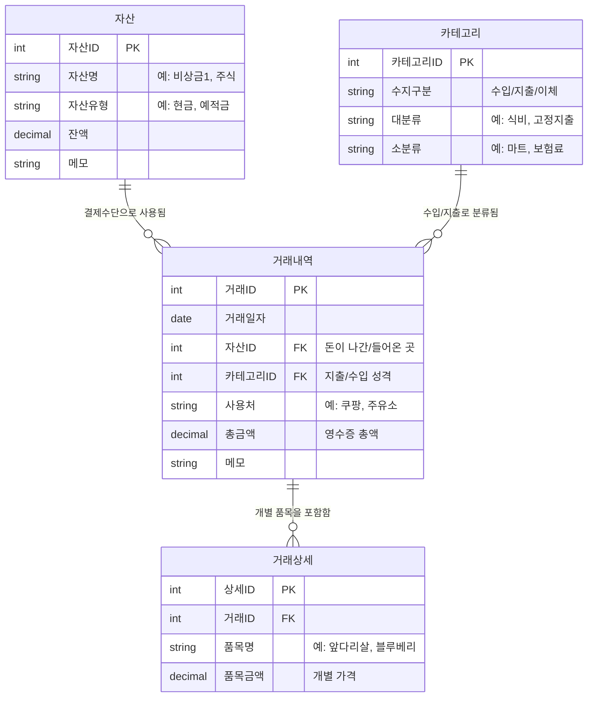

# 🍯 HoneyBudget (허니버짓)
> **Where Love and Hope Sprout** 🌱  
>  혼자쓰려고 만드는 희망이 싹트는 달콤한 우리 집 가계부 

## 📌 Features
- [ ] 카테고리(Category)별 지출/수입 분류
- [ ] 거래 내역(Transaction) CRUD
- [ ] 월별 지출 합계 및 예산 관리

## 🛠 Tech Stack
- **Language:** Java 17 
- **Framework:** Spring Boot 3.x
- **ORM:** : JPA
- **Database:** H2 (Dev), MySQL

## 🧩 Database Modeling 

