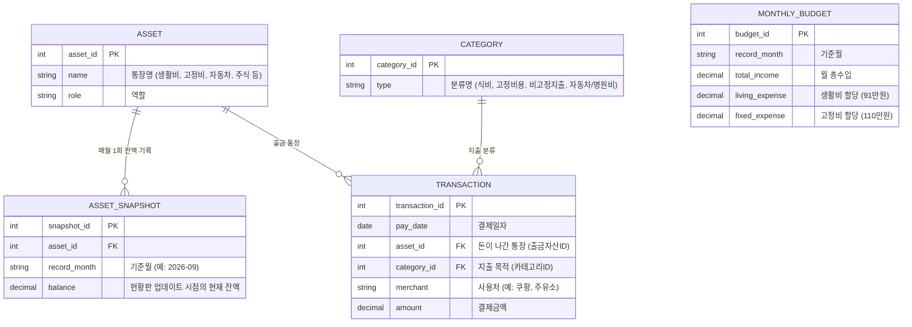

# 🍯 HoneyBudget (허니버짓)
> **Where Love and Hope Sprout** 🌱  
>  혼자쓰려고 만드는 희망이 싹트는 달콤한 우리 집 가계부 

## 📌 Features
- [ ] 카테고리(Category)별 지출/수입 분류
- [ ] 거래 내역(Transaction) CRUD
- [ ] 월별 지출 합계 및 예산 관리

## 🛠 Tech Stack
- **Language:** Java 17 
- **Framework:** Spring Boot 3.x
- **ORM:** : JPA
- **Database:** H2 (Dev), MySQL

## 🧩 Database Modeling 
2026년 9월 13일 20시 45분 33초 기준으로 깃허브(GitHub)가 지원하는 내장 Mermaid 렌더링 엔진의 엄격한 문법 스펙을 확인해 본 결과, 엔티티(테이블) 이름에 한글, 특수문자(/, ()), 띄어쓰기가 포함되어 파싱 에러가 발생한 것입니다.

깃허브 환경에서 에러 없이 깔끔하게 렌더링되도록, 엔티티명은 영문 대문자로 변경하고 한글 설명은 속성 옆에 주석 형태로 달아두는 안전한 표준 문법으로 수정했습니다.

아래 코드를 그대로 복사해서 깃허브 README.md에 붙여넣으시면 정상적으로 그려집니다.

Markdown

